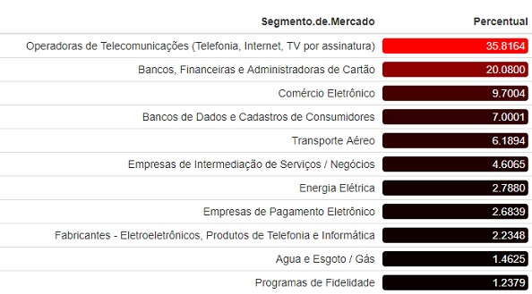
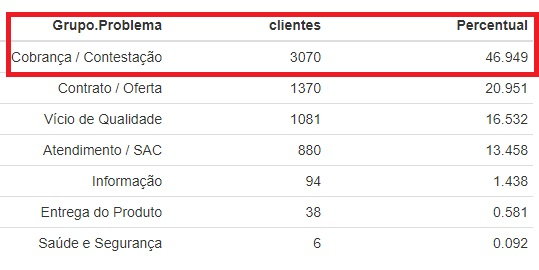
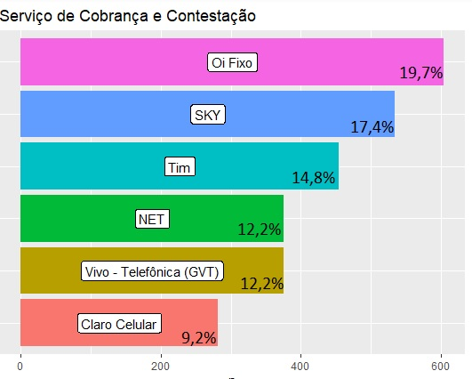
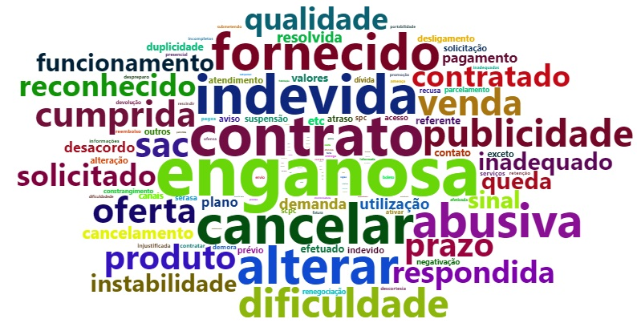

### <font color="yellow"> Qual a dimensão dos impactos das reclamações em órgãos de proteção ao consumidor, sobre as empresas de um determinado setor?</font>
-------------

<p align="center">

  </p>
  
As reclamações fazem parte de qualquer operação de atendimento ao cliente. Entretanto, o avanço das tecnologias da informação e comunicações gerou um cenário de fortes transformações, o ambiente do [pós-consumo](onsumidormoderno.com.br/2018/09/06/era-do-pos-consumo-presume-novas-relacoes-de-concorrencia-e-prioridades/), onde consumir já não é mais suficiente.


<p style="text-align:justify">Para o pós-consumidor a experiência é parte fundamental da sua jornada. Este novo consumidor é muito resistente a burocracia, lida mal qualquer tipo de fricção nas relações de consumo, considera que as informações devem fluir em tempo real e vê na falta de transparência uma postura inaceitável.</p>

<p style="text-align:justify">A profunda mudança que vem ocorrendo no perfil social do consumidor não é acompanhada pelas organizações e em alguns setores, com grandes volumes de negócios, a mudança parece estar longe de atender minimamente aos interesses dos clientes, o que torna esta situação ainda mais conflituosa.</p> 

<p style="text-align:justify">Como a diferenciação das ofertas, cada vez mais se dá pela qualidade das experiências, gerar clientes insatisfeitos expõe fragilidades nas relações de consumo e as decepções ecoam na Internet, afetando imagens e resultados. Os setores de atendimento ao cliente, que lidam principalmente com reclamações, parecem estar na idade da pedra.</p> 

<p style="text-align:justify"> **A questão que se coloca é; as empresas estão ajustando suas estratégias e procedimentos para lidar com as situações de reclamação dos pós-consumidores, ou suas estruturas ainda estão ajustadas para o consumidor do passado?**</p>

<p style="text-align:justify">Diante desta questão, o enfoque deste projeto está em fazer análises do comportamento de algumas empresas frente as reclamações, seja de forma direta, seja através de órgãos de defesa do consumidor, com o foco na solução do problema.</p>

Para isto foram recolhidos dados do site [Dados.gov.br](http://dados.gov.br/dataset/reclamacoes-do-consumidor-gov-br1) compreendendo o segundo semestre de 2019 de todo território nacional, mas para este projeto interessa apenas os dados referentes ao estado do Rio de Janeiro.

<p style="text-align:justify">Todo o projeto será realizado no R studio optou-se em trabalhar com a base no formato rds.</p>

```{r}
dadosBrasil <- read.table("dados/2019_semestre_2.csv", 
                         header = TRUE,
                          sep = ";", dec = ",")

readr::write_rds(dadosBrasil, "dados/dadosBrasil.rds")
```

<p style="text-align:justify">Selecionar o estado do Rio de Janeiro usando o **filter**  do pacote `dplyr`,em seguida carregar a base.</p>

```{r}
dadosRio <- dadosBrasil %>%
filter(UF=="RJ")
dadosRio <- readr::read_rds(path = "dados/dadosRio.rds")
```

<p style="text-align:justify">Esta análise foi estruturada em etapas e consequentes processos. O presente trabalho refere-se a primeira das etapas. As etapas dois, três e quatro serão parte de novos trabalhos.</p> 

 -------------

| Etapas| Processo de Análise das Empresas do Rio de Janeiro|
|:--------- | :------: | 
|:one:| Analisar as áreas em que mais houve reclamações e as empresas mais demandadas.|
|:two:|Após as análises da primeira etapa, identificar se houve, ou não, resposta da empresa diante da reclamação e se resolveram o problema.|
|:three:| Correlacionar as análises da segunda etapa com a avaliação dos clientes, ao final do processo.|
|:four:| Fazer uma análise das empresas que não foram avaliadas|

------------------

#### **Qual foi o segmento de mercado que mais houve reclamações?**

<p style="text-align:justify">Para iniciar o processo é importante identificar quais são os **segmentos de mercado**.Uma forma é agrupar e sumarizar os setores presentes deste segmento utilizando  **group_by** e o **summarise** , em seguida ordená-los em ordem decrescente com o **arrange** e criar uma coluna com os percentuais de cada um usando o **mutate**, todos presentes no pacote 
`dplyr`.</p>
 
```{r}
Segmento_mercado_reclamacao <- dadosRio %>%
  group_by(Segmento.de.Mercado) %>%
  summarise(clientes=n()) %>%
  arrange(desc(clientes)) %>%
  mutate(Percentual= clientes/sum(clientes)*100) 
```

<p style="text-align:justify">Com uma tabela fica mais fácil de visualizar, mas antes é preciso installar o pacote `formattable`.</p>

```{r}
formattable(Segmento_mercado_reclamacao,
            list(clientes = FALSE,
              Percentual =
                   formatter("span",style = x ~ style(
                     display = "block","border-radius" = "4px",
                     "padding-right" = "4px",color = "white",
                     "background-color" = rgb(x/max(x), 0, 0)))))
```
 
<p align="center">

  </p>
  
Pode-se observar que na tabela o mercado das Telecomunicações, constituído pelas operadoras de telecomunicações, de internet e de TV por assinatura, lidera o ranking das reclamações, com 35,81% de demonstrações de insatisfações. Não é raro ver notícias relacionadas a este assunto em veículos da grande mídia;  [Agência Brasil](https://agenciabrasil.ebc.com.br/geral/noticia/2019-03/empresas-de-telecomunicacoes-lideram-queixas-de-consumidores),[G1.Globo](https://g1.globo.com/economia/noticia/2020/03/10/empresas-de-telecomunicacao-lideram-reclamacoes-de-consumidores-em-2019.ghtml) e [Economia.Estadão](https://economia.estadao.com.br/noticias/geral,telefonia-e-setor-com-mais-reclamacoes-de-clientes-em-julho-segundo-consumidorgov,70002964779)
  
####  **Quais são os problemas que deixam os clientes insatisfeitos?**
 
<p style="text-align:justify">Uma vez que se sabe qual segmento de mercado que mais teve  reclamações, o proximo passo é saber quais são os problemas que afetam os clientes.</p>

<p style="text-align:justify">Usa-se o **filter** para filtar apenas o segmento de Telecomunicações  em seguida o **group_by** para agrupar por *Grupo.Problemas* e  por último, uma tabela para visualizar esses dados.</p>


```{r}
setor_telecomunicacao <- dadosRio %>% 
  filter (Segmento.de.Mercado==
            "Operadoras de Telecomunicações (Telefonia, Internet, TV por assinatura)")

problema_no_setor_telecomunicacao <- setor_telecomunicacao %>% 
  group_by(Grupo.Problema) %>% 
  summarise(clientes=n()) %>% 
  arrange(desc(clientes)) %>% 
  mutate(Percentual= clientes/sum(clientes)*100) 

formattable(problema_no_setor_telecomunicacao)
```

<p align="center">

  </p>

<p style="text-align:justify">Observe que segmento de Telecomunicações há diversas queixas, dentre elas estão atendimento/SAC, entrega do produto, contrato/oferta, vício de qualidade, porém o que mais deixou os clientes insatisfetos foi de Cobrança/Constentaçao com 47% de queixas.</p> 

O resultado desta análise corrobora o relatório “Inteligência e Diagnóstico das Relações de Consumo em Telecomunicações”, da [Anatel](https://www.anatel.gov.br/Portal/verificaDocumentos/documento.asp?numeroPublicacao=348242&assuntoPublicacao=null&caminhoRel=null&filtro=1&documentoPath=348242.pdf), onde motivo predominante de reclamações que chegam ao órgão regulador é o de **problemas com cobrança**, que vai desde de geração de cobranças indevidas, até serviços cobrados que não são entregues, Neste último as queixas são: “lentidão, ou velocidade reduzida de co as queixas são,“lentidão ou velocidade reduzida de conexão”; “sem conexão de dados” e “não cumprimento de agendamento de reparo”.

#### **Quem é alvo de tanta reclamação?**

<p style="text-align:justify">Os dados mostram as empresas que lideram o ranking das reclamações sobre cobrança/contestação no segundo semestre de 2019. o recurso desta vez para a vizualização foi um gráfico, é necessário ter os pacotes `ggplot2` e `tidyverse`.</p>

```{r}
ranking_empresa_reclamacao<- setor_telecomunicacao %>%
  filter(Grupo.Problema=="Cobrança / Contestação") %>%
  group_by(Nome.Fantasia) %>%
  summarise(n=n()) %>%
  arrange(desc(n)) %>%
  mutate(Nome.Fantasia = fct_reorder(Nome.Fantasia, n)) %>%
  mutate(Taxa=n/sum(n)*100) %>% 
  head() %>% view()    #visualizar o percentual

  ggplot2::ggplot(ranking_empresa_reclamacao) +
  geom_col(aes(x = Nome.Fantasia, y = n, fill = Nome.Fantasia), 
           show.legend = FALSE) +
  geom_label(aes(x = Nome.Fantasia, y = n/2, label = Nome.Fantasia)) +
  coord_flip()+
  labs(title= "Serviço de Cobrança e Contestação")
```

<p align="center">

  </p>

A empresa OI FIXO lidera o ranking com 19,7%, muitas dessas queixas tem relações com serviços cobrados sem a contratação do cliente, entre tantas histórias de queixas contra as operadoras está a de desconto relativos a doações a entidades e associações beneficentes em faturas telefônicas, segundo o site [Tribuna de Minas](https://tribunademinas.com.br/noticias/economia/15-12-2019/descontos-de-doacoes-em-contas-da-oi-sao-alvo-de-queixa.html) 

><p style="text-align:justify">A Tribuna recebeu a denúncia de uma família que se sentiu lesada ao receber cobrança de R$ 50 em sua conta telefônica. A filha do titular da conta alega que o pai é idoso, tem 87 anos e está acometido por Alzheimer, não tendo condições de responder pelas finanças da casa.A filha chegou a reclamar no Sedecon-Serviço de Defesa do Consumidor, da Câmara Municipal, contra a operadora e foi comunicada pela Oi que o cancelamento podia ser feito apenas pela própria associação. Em contato com a ouvidoria da AACI-Associação de Apoio à Criança e ao Idoso, ela conseguiu o estorno da quantia paga e recebeu o aviso de que o cadastro havia sido cancelado.</p>


<p style="text-align:justify">Casos parecidos  foram registrados pelo Sedecon e pelo Procon Juiz de Fora desde 2018, para superintendente do Procon/JF, Eduardo Schröder, a maior preocupação é com a forma como acontece o contato com os doadores, em especial os idosos, considerados vulneráveis onde acabam sendo lesados e até mesmo enganados, relatos como este não é muito díficil de encontrar um próximo a nós.</p>

### Que sensações uma reclamação pode gerar no cliente?

<p style="text-align:justify">O cliente, ao formalizar sua queixa, seja na empesa ou em órgãos de proteção ao consumidor, expressa sua indignação. Ao analisar os diversos textos reclamatórios da base de dados, foi gerada uma nuvem de palavras, que destaca as principais citações dos reclamantes em suas ações.</p>

Para esta análise usou os pacotes:`quanteda`,`Worcloud2`.

```{r}
setor_telecomunicacao <- dadosRio %>% 
  filter (Segmento.de.Mercado==
            "Operadoras de Telecomunicações (Telefonia, Internet, TV por assinatura)")

corpusquanteda<- corpus(setor_telecomunicacao$Problema)
dfm_corpusquanteda=corpusquanteda %>%
  tokens(remove_punct = TRUE, remove_numbers = TRUE, remove_symbols = TRUE) %>%
  tokens_remove(stopwords("pt")) %>%
  tokens_remove(c("serviço ","cobrança",   "após",
                  "pode","pra","ser","tomar","sobre","ainda","ter","vacina",
                  "vai","vou","diz","vem","gente","fica","serviço")) %>%
  tokens_remove(min_nchar=3) %>%
  dfm(tolower = TRUE, stem=FALSE) %>%#comando "stem" trabalha com os radicais 
  
  dfm_trim(min_docfreq = 0.001, docfreq_type = "prop")

corpus_2 <-corpus_subset(corpusquanteda, ntoken(dfm_corpusquanteda) > 0)
dfm_corpusquanteda<- dfm_subset(dfm_corpusquanteda, ntoken(dfm_corpusquanteda) > 0)

palavrastopfeatures= topfeatures(dfm_corpusquanteda, n=500)

palavrastopfeatures=tibble(word = names(palavrastopfeatures), 
                           freq = unname(palavrastopfeatures) )

wordcloud2(palavrastopfeatures, size = 0.5, minSize = 0, gridSize = 0.5,
           fontFamily = 'Segoe UI', fontWeight = 'bold',
           color = 'random-dark', backgroundColor = "white",
           minRotation = -pi/2, maxRotation = pi/2, shuffle = TRUE,
           rotateRatio = 0, shape = 'circle', ellipticity = 0.65,
           widgetsize = NULL, figPath = NULL, hoverFunction = NULL)
```

<p align="center">

  </p>
  
<p style="text-align:justify">A palavra “enganosa” aparece com maior destaque, o que evidencia essa sensação nas relações de consumo.</p> 

<p style="text-align:justify">Em uma breve conclusão da primeira etapa da análise, a empresa Oi aparece como a mais citada em reclamações. Como parte da análise, a segunda etapa pretende identificar, primeiro, se houve resposta da empresa e depois, se resolveram o problema. O objetivo é saber como a empresa lida com as reclamações de clientes.</p> 

<p style="text-align:justify">Lidar com problemas de forma transparente e ágil pode ser fator de diferenciação e caminho para o sucesso. Quando um cliente reclama, além de estar prestando um serviço a empresa, sinalizando suas fragilidades, o que ele deseja é ter seu problema resolvido. Isso pode se transformar numa experiência positiva, revertendo uma situação de frustração, para grande satisfação, o que pode recuperar o cliente e ainda torná-lo um *brand lover*, um fã da marca. Na era do pós-consumo, tornar um transtorno uma experiência positiva é fator gerador de vantagem competitiva, o que, em geral, se traduz em ganhos que vão além de produtos de boa qualidade.</p> 

#### Autor

Edlaine Viana [Linkedin](https://www.linkedin.com/in/edlaine-viana-69082514b/)
